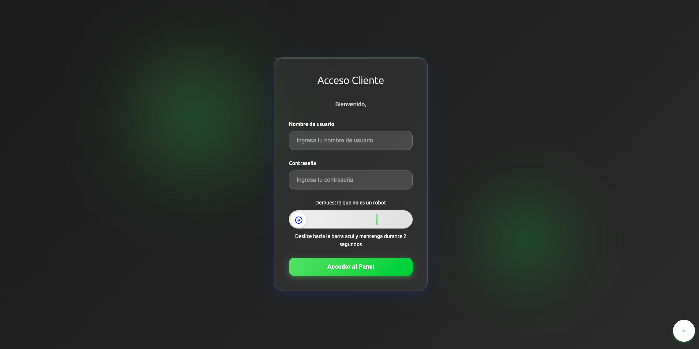
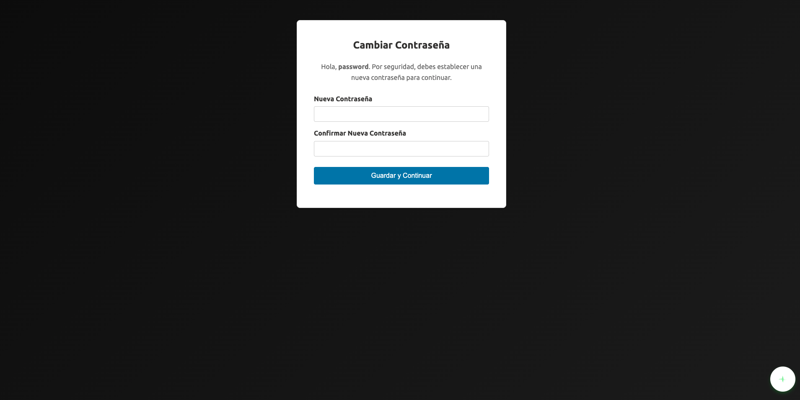

# Acceder a Inled AI. 
Para acceder a Inled AI precisas tener una cuenta de Inled AI.  
Para ello has de ponerte en contacto con Inled.  

# Tu primer inicio de sesión. 
Durante tu primer inicio de sesión deberás indicar el usuario y contraseña que has recibido de Inled.   
La página de login luce tal que así:  
. 
Para evitar los ataques de fuerza bruta se ha incorporado un límite de intentos de acceso y un detector de robots.  
Para poder iniciar sesión debes completar el desafío de verificación de que no eres un robot arrastrando la pastilla con la flecha hasta la línea verde y manteniendo hasta que la línea de progreso que aparecerá debajo se complete.  
.   
Después, una vez inicie sesión por primera vez, se le pedirá que cambie la contraseña.  
.   
La contraseña debe tener al menos 8 caracteres, una mayúscula y un número.  
¡Atención! Asegúrese de añadir la contraseña que va a poner al gestor de contraseñas por que de forma predeterminada el navegador no detecta que está cambiando la contraseña.  
Es un error nuestro que vamos a arreglar en breve.  

Una vez haya cambiado la contraseña se le redirigirá al panel de personalización de la IA