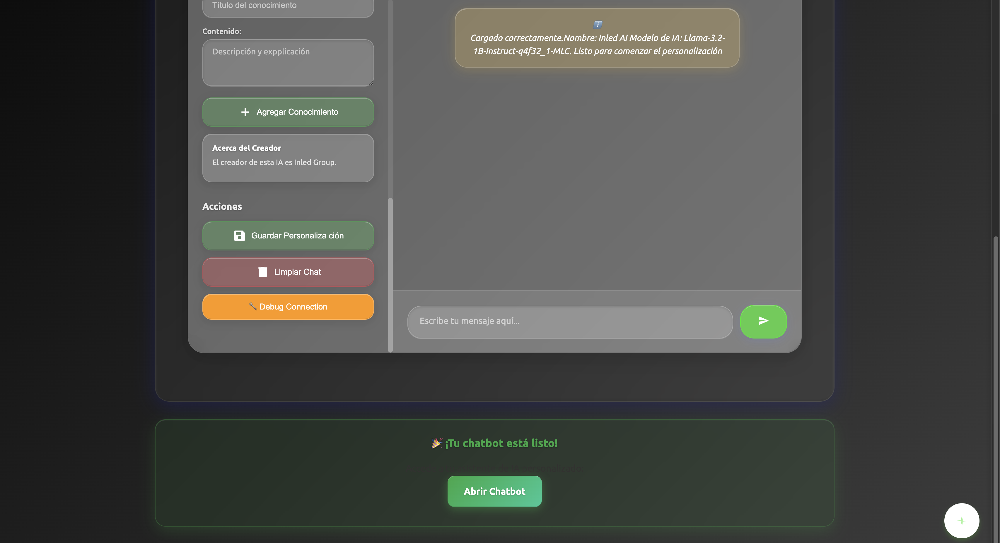
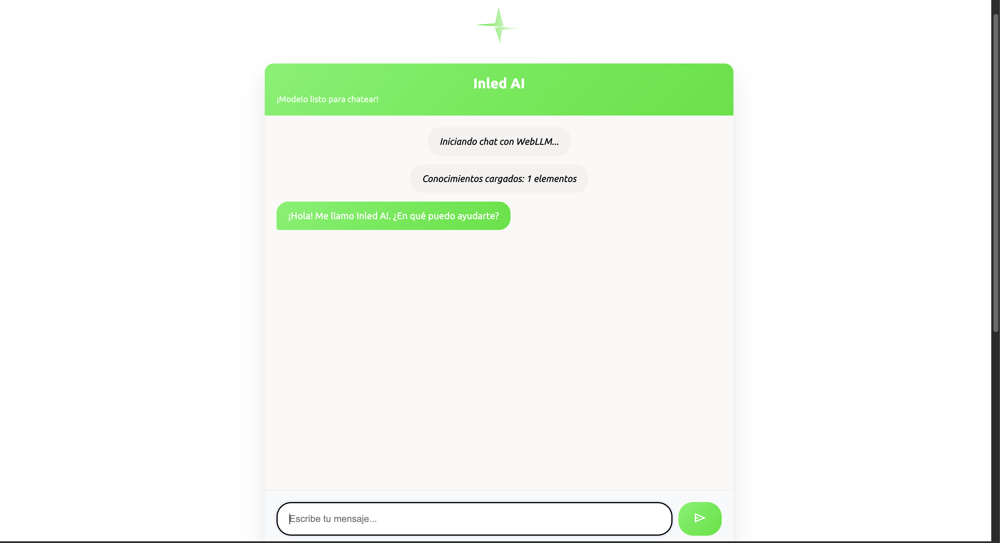
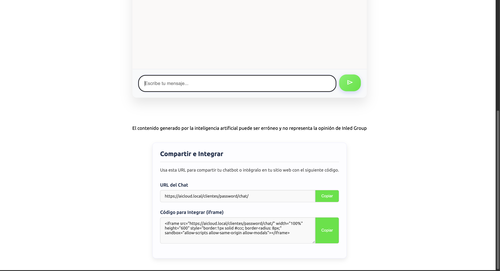

# El chat final. 
Una vez hayas terminado con la personalización podrás pulsar **Abrir chatbot**. ¡Tu chat ya será público!  
.   
Así es como luce el chat que verán tus clientes:  
.   
¡Pero esto no queda aquí!  
Debajo del chat hay una sección para embeberlo y copiar su enlace.
.  

## Compartir e integrar.  
- **URL chat**: La URL del chat que se puede enviar a través de cualquier aplicación de mensajería y es la que se utiliza para integrar tu chat con el plugin de Wordpress de Inled AI.  
- **Código para integrar (iframe)**: Este es el código HTML para meter Inled AI en tu sitio web haciendo Ctrl+C y Ctrl+V (Cmd si eres de Macintosh)
  
## ¡Cuidado!  
Eres el único responsable de las respuestas que pueda dar la IA que **tú** has personalizado.  
Cuida mucho la personalización que hagas ya que si lo haces mal la IA puede decir de todo.  
Ya de por sí los creadores de estos modelos los entrenan para que en producción no digan lo que no deben pero siempre es bueno cuidar la personalización para evitar el jailbreaking hacia tu IA.  
Te recomendamos ver los términos del servicio para comprender que Inled **no tiene responsabilidad alguna de las respuestas erróneas que aporte la IA** que tú has personalizado.