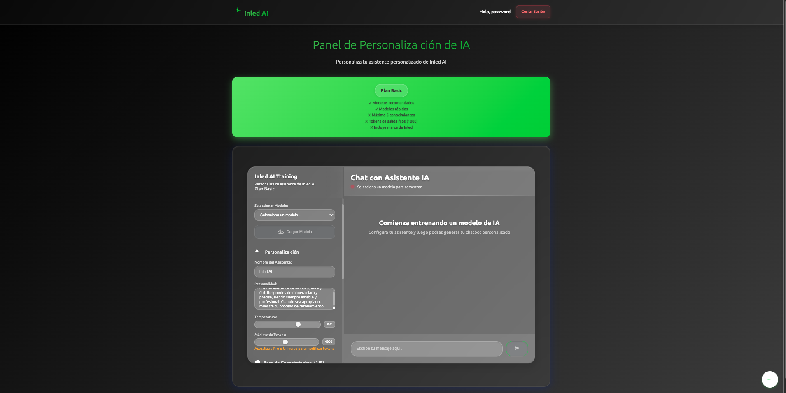
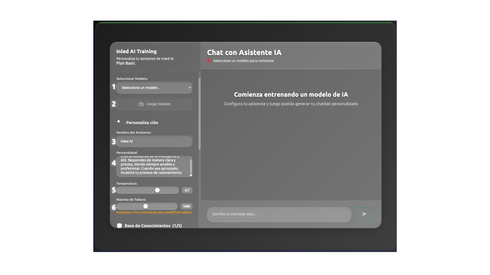
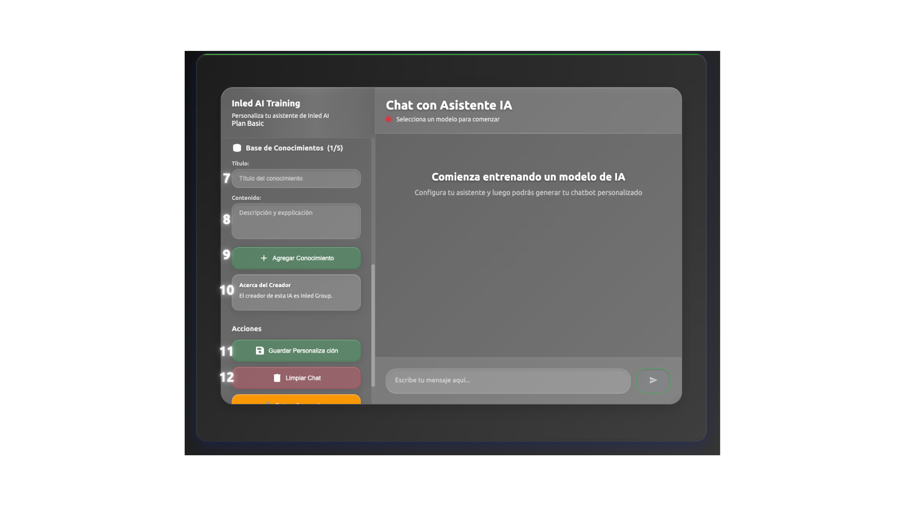

# El panel. 
Una vez dentro de Inled AI el panel de personalización de la IA es muy similar a este:  
.  
En la parte superior se detallan los beneficios de tu plan y lo que no tienes pero puedes conseguir con un plan superior.  
Más abajo del recuadro verde está la interfaz de entrenamiento. Vamos a desglosar todos sus componentes.  

## La interfaz de entrenamiento. 
. 
.   
1. **Selector modelos IA**: Desde aquí puedes seleccionar el modelo de IA que vas a usar. Dependiendo de tu plan podrás escoger más modelos.  
2. **Cargar el modelo**: Descarga el modelo para comenzar la personalización.  La primera vez puede tardar bastante y parecer que no avanza pero no te preocupes que avanzar avanza.  
3. **Nombre de la IA**: Título del chatbot. Este dato no lo conoce la IA.  
4. **Personalidad de la IA**: Aquí puedes especificar como quieres que se comporte la IA. Por ejemplo: `Vendedor de dispositivos Linux. Debe convencer al usuario de que deje de usar Windows` 
5. **Temperatura**: Cuanta imaginación tiene el modelo. Cuanto más baja más se ciñe a lo indicado, cuanto más alta más alucina. **Si se pone demasiado baja no va a hacer caso de la personalización**. 
6. **Máximo de tokens**: Cuantos tokens puede sacar.  
7. **Título del conocimiento**: Aquí se indica el título del conocimiento que quieres que adquiera la IA. Por ejemplo: `Tu nombre`
8. **Conocimiento**: Este es el contenido del conocimiento, por ejemplo: `Tu nombre es Inled AI`
9. **Agregar conocimiento**: Agrega el conocimiento al modelo de IA.  
10. **Conocimientos**: Aquí se muestran los conocimientos agregados. Se pueden eliminar todos excepto el de marca de agua de los planes básicos.  
11. **Guardar personalización**: Te permite guardar la personalización del modelo para lanzar el chatbot público. Te aparecerá debajo de la personalización un recuadro que te llevará al chat que verán los usuarios.  
12. **Limpiar chat**: ¿Has hablado mucho con tu IA? ¡Deja limpio el chat de la interfaz de personalización!
13. **Botón naranja DEBUG**: Permite obtener información del estado de la conexión con el servidor. Utilizar únicamente en caso de necesidad por parte de soporte técnico.